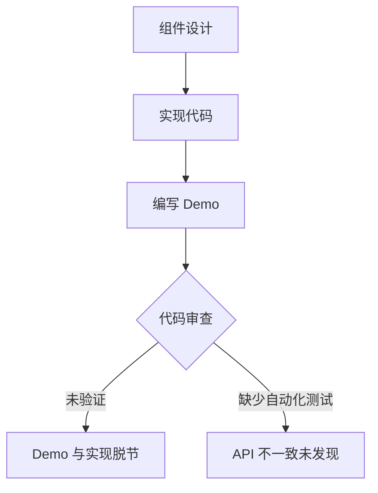
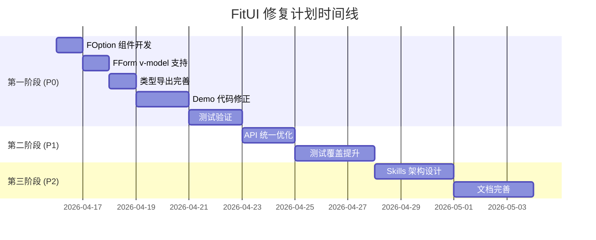
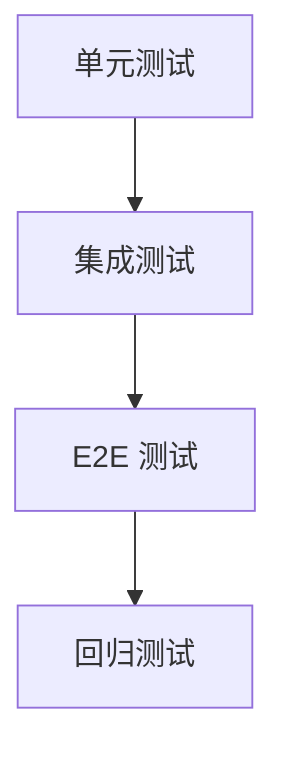
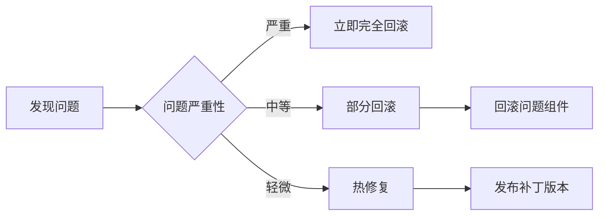
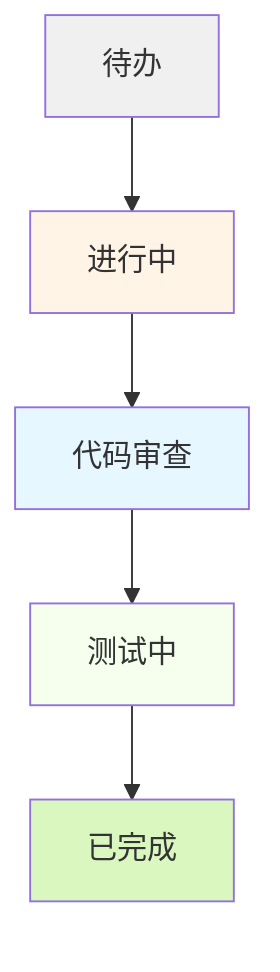
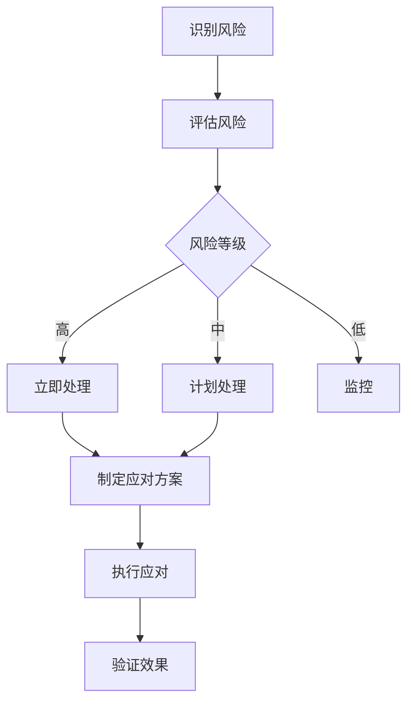
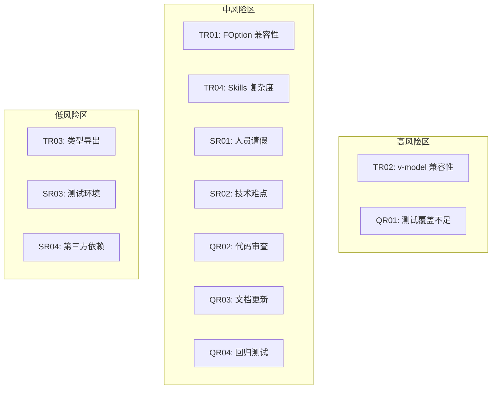

# FitUI 组件库修复计划

**文档版本**: 1.0.0  
**创建日期**: 2026-04-16  
**项目负责人**: FitUI Team  
**预计修复周期**: 2 周  

---

## 目录

1. [执行摘要](#1-执行摘要)
2. [问题分类与优先级](#2-问题分类与优先级)
3. [根本原因分析](#3-根本原因分析)
4. [修复目标与成功标准](#4-修复目标与成功标准)
5. [分阶段实施计划](#5-分阶段实施计划)
6. [资源需求](#6-资源需求)
7. [时间节点与里程碑](#7-时间节点与里程碑)
8. [测试方案](#8-测试方案)
9. [回滚策略](#9-回滚策略)
10. [进度跟踪机制](#10-进度跟踪机制)
11. [风险评估](#11-风险评估)
12. [附录](#12-附录)

---

## 1. 执行摘要

### 1.1 问题概述

FitUI 组件库存在**严重的 API 设计与文档不一致问题**，导致演示项目（fit-test）中的组件示例代码无法正常运行。主要问题包括：

- **虚构的组件**：FOption 组件在 demo 中使用但未在源码中定义
- **虚构的 API**：FForm 组件的 v-model 支持和 layout 属性不存在
- **类型缺失**：FormInstance 等关键类型未导出
- **属性不一致**：FTable 列定义属性混用

### 1.2 影响范围

| 影响维度 | 描述 |
|---------|------|
| **受影响组件数** | 5 个核心组件（FSelect、FForm、FTable、FTabs、FButton） |
| **受影响 demo 文件** | 8 个示例文件 |
| **用户影响** | 新用户无法按照示例正确使用组件 |
| **开发影响** | 联调测试无法进行，阻塞发布流程 |

### 1.3 修复紧急程度

**严重级别**: 🔴 **P0 - 紧急**

**理由**:
- 核心组件 API 与文档不一致
- 演示代码完全无法运行
- 严重影响用户体验和库的可信度

---

## 2. 问题分类与优先级

### 2.1 问题清单

| ID | 问题描述 | 组件 | 优先级 | 预计工时 | 依赖关系 |
|----|---------|------|--------|---------|---------|
| P0-01 | FOption 组件不存在 | FSelect | P0 | 4h | 无 |
| P0-02 | FForm v-model 支持缺失 | FForm | P0 | 6h | 无 |
| P0-03 | FForm layout 属性错误 | FForm | P0 | 2h | P0-02 |
| P0-04 | FormInstance 类型未导出 | FForm | P0 | 2h | 无 |
| P0-05 | FTable columns 属性不一致 | FTable | P0 | 4h | 无 |
| P1-06 | FTabs demo 内容重复 | FTabs | P1 | 1h | 无 |
| P1-07 | FButton icon 类型不匹配 | FButton | P1 | 2h | 无 |
| P1-08 | FRadio/Checkbox label/value 混淆 | FRadio/FCheckbox | P1 | 2h | 无 |
| P2-09 | 缺少 Skills 架构支持 | 全局 | P2 | 16h | 所有 P0 修复 |

### 2.2 优先级定义

| 优先级 | 定义 | 响应时间 | 修复时限 |
|-------|------|---------|---------|
| **P0** | 阻塞性错误，核心功能不可用 | 立即 | 24-48 小时 |
| **P1** | 重要功能缺陷，影响用户体验 | 1 个工作日 | 3-5 天 |
| **P2** | 优化改进，非阻塞性问题 | 3 个工作日 | 1-2 周 |

---

## 3. 根本原因分析

### 3.1 问题根源

#### 3.1.1 开发流程缺陷



**根本原因**:
- 缺少组件 API 的自动化验证机制
- Demo 代码未纳入 CI/CD 测试范围
- 代码审查流程未包含 API 一致性检查

#### 3.1.2 架构设计问题

1. **FSelect 组件设计缺陷**
   - 仅支持 `options` prop，不支持插槽式子组件
   - 与主流 UI 库（Element Plus、Ant Design Vue）API 不一致
   - 增加用户学习成本

2. **FForm 组件设计缺陷**
   - 使用 `model` prop 而非 `v-model`
   - 不符合 Vue 3 组件最佳实践
   - 缺少类型导出意识

3. **类型系统不完善**
   - 组件实例类型未统一导出
   - `ftypes/` 目录利用率低
   - 缺少类型聚合文件

### 3.2 影响链分析

```
FOption 不存在
  ↓
FSelect 无法使用插槽语法
  ↓
用户需要手动构造 options 数组
  ↓
学习成本增加，易用性下降
  ↓
用户流失风险 ↑
```

---

## 4. 修复目标与成功标准

### 4.1 修复目标

#### 4.1.1 核心目标（P0）

| 目标 | 描述 | 验收标准 |
|------|------|---------|
| **目标 1** | FSelect 支持 FOption 子组件 | 插槽语法可正常运行，通过单元测试 |
| **目标 2** | FForm 支持 v-model | `v-model="formData"` 可正常工作 |
| **目标 3** | 导出所有关键类型 | FormInstance 等类型可从库中导入 |
| **目标 4** | 修正所有 Demo 代码 | 所有示例代码可正常运行 |

#### 4.1.2 改进目标（P1）

| 目标 | 描述 | 验收标准 |
|------|------|---------|
| **目标 5** | 统一组件 API 设计 | 与主流 UI 库保持一致 |
| **目标 6** | 完善类型导出 | 所有组件提供 Instance 类型 |
| **目标 7** | 建立测试覆盖 | 核心组件测试覆盖率 > 80% |

#### 4.1.3 长期目标（P2）

| 目标 | 描述 | 验收标准 |
|------|------|---------|
| **目标 8** | Skills 架构设计 | 提供技能注册和调用 API |
| **目标 9** | 文档完善 | 每个组件提供 3+ 使用示例 |

### 4.2 成功标准

#### 4.2.1 技术指标

- ✅ 所有 P0 问题修复完成
- ✅ Demo 代码可运行率 100%
- ✅ 类型导出完整率 100%
- ✅ 单元测试通过率 100%
- ✅ 构建无错误、无警告

#### 4.2.2 用户体验指标

- ✅ 新用户可按照示例成功运行组件
- ✅ API 文档与实现一致
- ✅ TypeScript 类型提示正确

---

## 5. 分阶段实施计划

### 5.1 阶段划分



### 5.2 第一阶段：P0 紧急修复（第 1-5 天）

#### 任务 1.1：FOption 组件开发（4h）

**目标**: 为 FSelect 添加 FOption 子组件支持

**实施步骤**:

1. **创建组件文件** (`src/FSelect/Option.vue`)
   ```vue
   <template>
     <li class="f-select-option" :class="classes" @click="handleClick">
       <slot>{{ label }}</slot>
     </li>
   </template>

   <script setup lang="ts">
   defineOptions({ name: 'FOption' })

   const props = defineProps<{
     value: string | number
     label: string
     disabled?: boolean
   }>()

   const emit = defineEmits<{
     select: [value: string | number]
   }>()

   const classes = computed(() => ({
     'is-disabled': props.disabled
   }))

   const handleClick = () => {
     if (!props.disabled) {
       emit('select', props.value)
     }
   }
   </script>
   ```

2. **修改 FSelect 组件** (`src/FSelect/index.vue`)
   - 添加插槽支持，检测 FOption 子组件
   - 自动从插槽收集 options 数据

3. **导出组件** (`src/components.ts`)
   ```typescript
   export { default as FSelect } from './FSelect'
   export { FOption } from './FSelect'  // 新增
   ```

4. **添加样式** (`src/FSelect/style/_option.scss`)

**验收标准**:
- [ ] FOption 组件可独立使用
- [ ] FSelect 支持插槽语法
- [ ] 支持动态 disabled 状态
- [ ] 通过单元测试

**负责人**: 前端开发 A  
**交付物**: Option.vue, 样式文件，单元测试

---

#### 任务 1.2：FForm v-model 支持（6h）

**目标**: 为 FForm 添加 v-model 双向绑定支持

**实施步骤**:

1. **修改 FormProps** (`src/FForm/Form.ts`)
   ```typescript
   export interface FormProps {
     modelValue?: Record<string, any>  // 新增
     model?: Record<string, any>       // 保留向后兼容
     // ... 其他属性
   }
   ```

2. **修改 FForm 组件** (`src/FForm/index.vue`)
   ```typescript
   const props = withDefaults(defineProps<FormProps>(), {
     // ...
   })

   // 计算属性，支持 v-model
   const formData = computed({
     get: () => props.modelValue ?? props.model ?? {},
     set: (val) => emit('update:modelValue', val)
   })

   // 提供上下文时使用 formData
   provide(FORM_CONTEXT_KEY, {
     model: formData,
     // ...
   })
   ```

3. **添加 emits 定义**
   ```typescript
   const emit = defineEmits<{
     'update:modelValue': [value: Record<string, any>]
     // ...
   }>()
   ```

**验收标准**:
- [ ] 支持 `v-model="formData"` 语法
- [ ] 兼容旧的 `:model` 语法
- [ ] 双向绑定正常工作
- [ ] 通过单元测试

**负责人**: 前端开发 B  
**交付物**: 修改后的 Form.ts, index.vue，单元测试

---

#### 任务 1.3：FForm layout 属性修正（2h）

**目标**: 修正 inline 属性的使用方式

**实施步骤**:

1. **保持现有 API** (`src/FForm/Form.ts`)
   ```typescript
   export interface FormProps {
     inline?: boolean  // 保持不变
     // 不添加 layout 属性
   }
   ```

2. **修改 Demo 代码** (`packages/fit-test/src/examples/FForm/index.vue`)
   ```vue
   <!-- 错误 -->
   <FForm layout="inline" ...>

   <!-- 正确 -->
   <FForm :inline="true" ...>
   ```

**验收标准**:
- [ ] Demo 代码使用 `:inline="true"`
- [ ] 所有行内表单示例正常工作

**负责人**: 前端开发 A  
**交付物**: 修正后的 demo 文件

---

#### 任务 1.4：FormInstance 类型导出（2h）

**目标**: 导出 FForm 组件实例类型

**实施步骤**:

1. **创建类型文件** (`src/FForm/types.ts`)
   ```typescript
   import type { FormRule } from './Form'

   export interface FormInstance {
     /**
      * 验证整个表单
      */
     validate: () => Promise<boolean>
     /**
      * 验证指定字段
      */
     validateField: (prop: string, callback?: (error?: string) => void) => Promise<boolean>
     /**
      * 重置所有字段
      */
     resetFields: () => void
     /**
      * 清除指定字段验证错误
      */
     clearValidate: (props?: string | string[]) => void
     /**
      * 滚动到错误字段
      */
     scrollToError: (prop: string) => void
   }

   export interface FormItemInstance {
     validate: () => Promise<boolean>
     clearValidate: () => void
     resetField: () => void
   }
   ```

2. **在组件中应用类型** (`src/FForm/index.vue`)
   ```typescript
   defineExpose<FormInstance>({
     validate,
     validateField: formContext.validateField,
     resetFields,
     clearValidate,
     scrollToField,
   })
   ```

3. **导出类型** (`src/components.ts`)
   ```typescript
   export type { FormInstance, FormItemInstance } from './FForm/types'
   ```

**验收标准**:
- [ ] 可从 `@geniusmanyxh/fit-ui` 导入 FormInstance
- [ ] TypeScript 类型提示正确
- [ ] IDE 自动补全正常

**负责人**: 前端开发 B  
**交付物**: types.ts, 更新的 index.vue

---

#### 任务 1.5：FTable columns 属性统一（4h）

**目标**: 统一 FTable 列定义属性

**实施步骤**:

1. **方案选择**（需团队讨论）
   - **方案 A**: 使用 `key` + `label`（当前实现）
   - **方案 B**: 使用 `dataIndex` + `title`（与 Ant Design 一致）
   - **方案 C**: 同时支持两种语法（推荐）

2. **实施方案 C** (`src/FTable/Table.ts`)
   ```typescript
   export interface TableColumn {
     // 主属性
     key?: string
     dataIndex?: string  // 别名
     label?: string
     title?: string      // 别名

     // 其他属性保持不变
     width?: string | number
     minWidth?: string | number
     align?: TableAlignType
     // ...
   }
   ```

3. **添加兼容层** (`src/FTable/index.vue`)
   ```typescript
   const normalizedColumns = computed(() => {
     return props.columns.map(col => ({
       ...col,
       key: col.key ?? col.dataIndex,
       label: col.label ?? col.title
     }))
   })
   ```

4. **更新 Demo** (`packages/fit-test/src/examples/FTable/index.vue`)
   ```typescript
   // 统一使用 key + label
   const columns = [
     { key: 'id', label: 'ID' },
     { key: 'name', label: '姓名' },
   ]
   ```

**验收标准**:
- [ ] 支持两种属性命名方式
- [ ] Demo 代码统一使用新规范
- [ ] 向后兼容旧代码

**负责人**: 前端开发 A  
**交付物**: 更新的 Table.ts, index.vue，Demo 文件

---

#### 任务 1.6：Demo 代码全面修正（8h）

**目标**: 修正所有 demo 文件中的错误

**涉及文件**:
- `packages/fit-test/src/examples/FSelect/index.vue`
- `packages/fit-test/src/examples/FForm/index.vue`
- `packages/fit-test/src/examples/FTable/index.vue`
- `packages/fit-test/src/examples/FTabs/index.vue`
- `packages/fit-test/src/examples/FButton/index.vue`
- `packages/fit-test/src/examples/FCheckbox/index.vue`
- `packages/fit-test/src/examples/FRadio/index.vue`

**修正内容**:
1. FSelect 改用 FOption 组件或正确的 options prop 语法
2. FForm 改用 `:model` 和 `:inline="true"`
3. FTable 统一 columns 定义
4. FTabs 删除重复场景
5. FButton 检查 icon 类型
6. FRadio/FCheckbox 明确 label/value 用途

**验收标准**:
- [ ] 所有 demo 可正常运行
- [ ] 控制台无错误、无警告
- [ ] 组件功能正常

**负责人**: 前端开发 B  
**交付物**: 修正后的 demo 文件

---

### 5.3 第二阶段：P1 优化改进（第 6-10 天）

#### 任务 2.1：API 统一优化（8h）

**目标**: 统一所有组件的 API 设计风格

**实施步骤**:

1. **制定 API 规范文档**
   ```markdown
   ## 组件命名规范
   - 组件名：F + 大写单词 (FButton, FInput)
   - 子组件：F + 父组件名 + 子组件名 (FSelectOption, FTabPane)

   ## Props 命名规范
   - 布尔值：is/disabled/clearable/sortable
   - 回调函数：onXxxChange/onXxxClick
   - 双向绑定：modelValue + update:modelValue

   ## Events 命名规范
   - 变更事件：change
   - 更新事件：update:modelValue
   - 组件事件：tab-click/option-select
   ```

2. **审查所有组件 API**
   - 检查 props 命名一致性
   - 检查 events 命名一致性
   - 检查 emits 定义完整性

3. **修正不一致的 API**
   - 统一布尔值前缀
   - 统一回调函数命名
   - 补充缺失的 emits

**负责人**: 前端开发 A+B  
**交付物**: API 规范文档，修正后的组件

---

#### 任务 2.2：类型导出完善（4h）

**目标**: 为所有组件导出 Instance 类型

**实施步骤**:

1. **创建类型聚合文件** (`src/types/index.ts`)
   ```typescript
   export type {
     // 表单组件
     FormInstance,
     FormItemInstance,
     InputInstance,
     SelectInstance,
     // 数据展示
     TableInstance,
     // 反馈组件
     ModalInstance,
     MessageInstance,
     // ... 所有组件
   }
   ```

2. **为每个组件添加 Instance 类型**
   - FInput: InputInstance
   - FSelect: SelectInstance
   - FTable: TableInstance
   - FModal: ModalInstance
   - ...

3. **统一导出** (`src/index.ts`)
   ```typescript
   export * from './components'
   export * from './types'
   ```

**负责人**: 前端开发 B  
**交付物**: types/index.ts, 各组件类型文件

---

#### 任务 2.3：测试覆盖提升（12h）

**目标**: 为核心组件添加完整的单元测试

**实施步骤**:

1. **制定测试策略**
   ```typescript
   // 测试覆盖范围
   - Props 测试：所有 props 的默认值和自定义值
   - Events 测试：所有 emits 的触发场景
   - Slots 测试：默认插槽和具名插槽
   - 方法测试：expose 的公共方法
   - 状态测试：disabled/loading 等状态
   ```

2. **编写测试用例**
   ```typescript
   // FSelect.test.ts
   describe('FSelect', () => {
     test('renders correctly', () => {})
     test('v-model works', () => {})
     test('FOption slot works', () => {})
     test('disabled state', () => {})
     test('change event', () => {})
   })
   ```

3. **运行测试并修复问题**
   ```bash
   pnpm test:run
   ```

**负责人**: 前端开发 A  
**交付物**: 测试文件，测试报告

---

### 5.4 第三阶段：P2 架构优化（第 11-15 天）

#### 任务 3.1：Skills 架构设计（16h）

**目标**: 设计并实现 Skills 能力调用架构

**实施步骤**:

1. **定义 Skills 接口** (`src/types/skill.ts`)
   ```typescript
   /**
    * UI 技能接口
    */
   export interface UISkill {
     /** 技能名称 */
     name: string
     /** 技能描述 */
     description: string
     /** 技能版本 */
     version: string
     /** 应用技能到组件 */
     apply<T extends Component>(component: T, options?: SkillOptions): T
     /** 移除技能 */
     remove<T extends Component>(component: T): T
   }

   /**
    * 技能选项
    */
   export interface SkillOptions {
     [key: string]: any
   }

   /**
    * 技能管理器
    */
   export interface SkillManager {
     register(skill: UISkill): void
     unregister(name: string): void
     apply(name: string, component: Component, options?: SkillOptions): void
   }
   ```

2. **实现技能管理器** (`src/utils/skillManager.ts`)
   ```typescript
   import type { UISkill, SkillManager } from '../types/skill'

   class FitSkillManager implements SkillManager {
     private skills: Map<string, UISkill> = new Map()

     register(skill: UISkill): void {
       this.skills.set(skill.name, skill)
     }

     unregister(name: string): void {
       this.skills.delete(name)
     }

     apply(name: string, component: Component, options?: SkillOptions): void {
       const skill = this.skills.get(name)
       if (!skill) {
         console.warn(`Skill "${name}" not found`)
         return
       }
       skill.apply(component, options)
     }
   }

   export const skillManager: SkillManager = new FitSkillManager()
   ```

3. **在组件中集成 Skills** (`src/FButton/index.vue`)
   ```typescript
   // 在组件初始化时应用技能
   onMounted(() => {
     if (skillManager) {
       skillManager.apply('theme', instance, { theme: 'dark' })
     }
   })
   ```

4. **导出 Skills API** (`src/index.ts`)
   ```typescript
   export { skillManager } from './utils/skillManager'
   export type { UISkill, SkillOptions, SkillManager } from './types/skill'
   ```

**负责人**: 架构师  
**交付物**: skill.ts, skillManager.ts, 集成示例

---

#### 任务 3.2：文档完善（12h）

**目标**: 为每个组件提供完整的使用文档

**实施步骤**:

1. **制定文档模板**
   ```markdown
   # 组件名称

   ## 介绍
   组件描述和使用场景

   ## 基础用法
   最简单的使用示例

   ## API

   ### Props
   | 属性 | 说明 | 类型 | 默认值 |
   |------|------|------|--------|

   ### Events
   | 事件名 | 说明 | 回调参数 |
   |--------|------|----------|

   ### Slots
   | 插槽名 | 说明 | 作用域参数 |
   |--------|------|------------|

   ### Methods
   | 方法名 | 说明 | 参数 | 返回值 |

   ## 示例
   3-5 个典型使用场景
   ```

2. **为每个组件编写文档**
   - FButton
   - FInput
   - FSelect
   - FForm
   - FTable
   - ...

3. **更新 README**
   - 快速开始
   - 安装指南
   - 使用示例

**负责人**: 技术文档工程师  
**交付物**: 组件文档，README

---

## 6. 资源需求

### 6.1 人力资源

| 角色 | 人数 | 职责 | 投入时间 |
|------|------|------|---------|
| **前端开发 A** | 1 | P0 核心组件修复，P1 测试 | 5 天 |
| **前端开发 B** | 1 | P0 类型导出，P1 API 优化 | 5 天 |
| **架构师** | 1 | P2 Skills 架构设计 | 3 天 |
| **技术文档工程师** | 1 | P2 文档完善 | 3 天 |
| **测试工程师** | 1 | 测试验证，回归测试 | 2 天 |
| **项目经理** | 1 | 进度跟踪，风险管理 | 全程 |

**总计**: 6 人，预计 15 个工作日

### 6.2 技术资源

| 资源 | 用途 | 备注 |
|------|------|------|
| **开发环境** | 代码开发和测试 | 已有 |
| **测试环境** | 集成测试 | 需要搭建 |
| **CI/CD 流水线** | 自动化测试和部署 | 需要配置 |
| **文档站点** | 文档托管 | GitHub Pages |

### 6.3 工具资源

| 工具 | 用途 | 许可 |
|------|------|------|
| **Vitest** | 单元测试 | MIT |
| **TypeScript** | 类型检查 | Apache-2.0 |
| **VitePress** | 文档生成 | MIT |
| **GitHub Actions** | CI/CD | 免费 |

---

## 7. 时间节点与里程碑

### 7.1 关键里程碑

```mermaid
gantt
    title FitUI 修复计划里程碑
    dateFormat  YYYY-MM-DD
    section 第一阶段
    M1: FOption 完成      :milestone, m1, 2026-04-17, 0d
    M2: FForm v-model 完成 :milestone, m2, 2026-04-18, 0d
    M3: 类型导出完成      :milestone, m3, 2026-04-19, 0d
    M4: Demo 修正完成     :milestone, m4, 2026-04-21, 0d
    M5: P0 测试通过      :milestone, m5, 2026-04-23, 0d
    section 第二阶段
    M6: API 统一完成      :milestone, m6, 2026-04-25, 0d
    M7: 测试覆盖达标      :milestone, m7, 2026-04-28, 0d
    section 第三阶段
    M8: Skills 架构完成   :milestone, m8, 2026-05-01, 0d
    M9: 文档完善完成      :milestone, m9, 2026-05-04, 0d
    M10: 项目验收        :milestone, m10, 2026-05-05, 0d
```

### 7.2 详细时间表

| 日期 | 阶段 | 任务 | 负责人 | 交付物 |
|------|------|------|--------|--------|
| **Day 1** | P0 | FOption 组件开发 | 前端 A | Option.vue, 样式，测试 |
| **Day 2** | P0 | FForm v-model 支持 | 前端 B | Form.ts, index.vue |
| **Day 3** | P0 | 类型导出完善 | 前端 B | types.ts |
| **Day 4** | P0 | Demo 代码修正 (1/2) | 前端 A | 修正的 demo 文件 |
| **Day 5** | P0 | Demo 代码修正 (2/2) + 测试 | 前端 B | 修正的 demo 文件 |
| **Day 6** | P0 | P0 测试验证 | 测试工程师 | 测试报告 |
| **Day 7-8** | P1 | API 统一优化 | 前端 A+B | API 规范，修正的组件 |
| **Day 9-10** | P1 | 类型导出完善 | 前端 B | types/index.ts |
| **Day 11-13** | P1 | 测试覆盖提升 | 前端 A | 测试文件，报告 |
| **Day 14-16** | P2 | Skills 架构设计 | 架构师 | skill.ts, skillManager.ts |
| **Day 17-19** | P2 | 文档完善 | 文档工程师 | 组件文档，README |
| **Day 20** | P2 | 最终验收 | 全员 | 验收报告 |

---

## 8. 测试方案

### 8.1 测试策略

#### 8.1.1 测试层次



#### 8.1.2 测试范围

| 测试类型 | 覆盖范围 | 目标 |
|---------|---------|------|
| **单元测试** | 单个组件的功能 | 验证组件内部逻辑 |
| **集成测试** | 组件间交互 | 验证组件协作 |
| **E2E 测试** | 完整用户流程 | 验证用户体验 |
| **回归测试** | 所有修复的问题 | 确保问题不复发 |

### 8.2 单元测试方案

#### 8.2.1 FSelect 测试用例

```typescript
// FSelect.test.ts
import { mount } from '@vue/test-utils'
import { describe, it, expect } from 'vitest'
import FSelect, { FOption } from '../index'

describe('FSelect', () => {
  // Props 测试
  describe('Props', () => {
    it('renders with options prop', () => {
      const wrapper = mount(FSelect, {
        props: {
          options: [
            { value: '1', label: '选项 1' },
            { value: '2', label: '选项 2' }
          ]
        }
      })
      expect(wrapper.findAll('.f-select__item').length).toBe(2)
    })

    it('renders with FOption slots', () => {
      const wrapper = mount(FSelect, {
        slots: {
          default: `
            <FOption value="1" label="选项 1" />
            <FOption value="2" label="选项 2" />
          `
        }
      })
      expect(wrapper.findAll('.f-select__item').length).toBe(2)
    })

    it('handles disabled prop', () => {
      const wrapper = mount(FSelect, {
        props: { disabled: true }
      })
      expect(wrapper.classes()).toContain('is-disabled')
    })
  })

  // Events 测试
  describe('Events', () => {
    it('emits change event', async () => {
      const wrapper = mount(FSelect, {
        props: {
          options: [{ value: '1', label: '选项 1' }]
        }
      })
      await wrapper.find('.f-select__item').trigger('click')
      expect(wrapper.emitted('change')).toBeTruthy()
      expect(wrapper.emitted('change')[0]).toEqual(['1'])
    })

    it('emits update:modelValue with v-model', async () => {
      const wrapper = mount(FSelect, {
        props: {
          modelValue: '1',
          'onUpdate:modelValue': (val) => wrapper.setProps({ modelValue: val }),
          options: [
            { value: '1', label: '选项 1' },
            { value: '2', label: '选项 2' }
          ]
        }
      })
      await wrapper.find('.f-select__item').trigger('click')
      expect(wrapper.emitted('update:modelValue')).toBeTruthy()
    })
  })

  // Slots 测试
  describe('Slots', () => {
    it('renders default slot', () => {
      const wrapper = mount(FSelect, {
        slots: {
          default: '<FOption value="1" label="选项 1" />'
        }
      })
      expect(wrapper.find('.f-select-option').exists()).toBe(true)
    })
  })

  // Methods 测试
  describe('Methods', () => {
    it('focus method works', async () => {
      const wrapper = mount(FSelect)
      await wrapper.vm.focus()
      expect(wrapper.find('.f-select__trigger').element).toBe(document.activeElement)
    })

    it('blur method works', async () => {
      const wrapper = mount(FSelect)
      await wrapper.vm.blur()
      expect(wrapper.find('.f-select__trigger').element).not.toBe(document.activeElement)
    })
  })
})
```

#### 8.2.2 FForm 测试用例

```typescript
// FForm.test.ts
import { mount } from '@vue/test-utils'
import { describe, it, expect } from 'vitest'
import FForm, { FFormItem } from '../index'

describe('FForm', () => {
  // v-model 测试
  describe('v-model', () => {
    it('works with v-model syntax', async () => {
      const formData = reactive({ username: '' })
      const wrapper = mount(FForm, {
        props: {
          modelValue: formData,
          'onUpdate:modelValue': (val) => Object.assign(formData, val)
        },
        slots: {
          default: `
            <FFormItem prop="username">
              <input v-model="formData.username" />
            </FFormItem>
          `
        }
      })
      // 测试双向绑定
    })

    it('compatible with :model prop', () => {
      const model = { username: 'test' }
      const wrapper = mount(FForm, {
        props: { model }
      })
      expect(wrapper.vm.model).toEqual(model)
    })
  })

  // inline 属性测试
  describe('inline prop', () => {
    it('renders inline form', () => {
      const wrapper = mount(FForm, {
        props: { inline: true }
      })
      expect(wrapper.classes()).toContain('f-form--inline')
    })

    it('does not render inline by default', () => {
      const wrapper = mount(FForm)
      expect(wrapper.classes()).not.toContain('f-form--inline')
    })
  })

  // 验证方法测试
  describe('Methods', () => {
    it('validate method works', async () => {
      const wrapper = mount(FForm, {
        props: {
          model: { username: '' },
          rules: {
            username: [{ required: true, message: '请输入用户名' }]
          }
        }
      })
      const isValid = await wrapper.vm.validate()
      expect(isValid).toBe(false)
    })

    it('resetFields method works', async () => {
      const model = { username: 'test' }
      const wrapper = mount(FForm, {
        props: { model }
      })
      await wrapper.vm.resetFields()
      expect(model.username).toBeUndefined()
    })
  })
})
```

### 8.3 集成测试方案

#### 8.3.1 表单 + 输入框集成测试

```typescript
// FormInput.integration.test.ts
import { mount } from '@vue/test-utils'
import { describe, it, expect } from 'vitest'
import { FForm, FFormItem, FInput, FButton } from '@geniusmanyxh/fit-ui'

describe('Form + Input Integration', () => {
  it('complete form workflow', async () => {
    const wrapper = mount({
      template: `
        <FForm ref="formRef" :model="formData" :rules="rules">
          <FFormItem label="用户名" prop="username">
            <FInput v-model="formData.username" />
          </FFormItem>
          <FFormItem>
            <FButton type="primary" @click="handleSubmit">提交</FButton>
          </FFormItem>
        </FForm>
      `,
      data() {
        return {
          formData: { username: '' },
          rules: {
            username: [{ required: true, message: '请输入用户名' }]
          }
        }
      },
      methods: {
        handleSubmit() {
          return this.$refs.formRef.validate()
        }
      }
    })

    // 测试完整流程
    await wrapper.find('button').trigger('click')
    expect(wrapper.find('.f-form-item__error').exists()).toBe(true)

    await wrapper.find('input').setValue('test')
    await wrapper.find('button').trigger('click')
    expect(wrapper.emitted('submit')).toBeTruthy()
  })
})
```

### 8.4 E2E 测试方案

#### 8.4.1 Playwright 测试用例

```typescript
// e2e/form.spec.ts
import { test, expect } from '@playwright/test'

test.describe('FForm E2E Tests', () => {
  test('should submit form successfully', async ({ page }) => {
    await page.goto('/examples/form')

    // 填写表单
    await page.fill('[data-field="username"]', 'testuser')
    await page.fill('[data-field="password"]', 'password123')
    await page.fill('[data-field="email"]', 'test@example.com')

    // 提交表单
    await page.click('button[type="submit"]')

    // 验证提交成功
    await expect(page.locator('.f-message--success')).toBeVisible()
  })

  test('should show validation errors', async ({ page }) => {
    await page.goto('/examples/form')

    // 直接提交空表单
    await page.click('button[type="submit"]')

    // 验证错误提示
    await expect(page.locator('.f-form-item__error')).toHaveCount(3)
  })
})
```

### 8.5 回归测试方案

#### 8.5.1 回归测试清单

| 测试项 | 测试内容 | 预期结果 |
|--------|---------|---------|
| **RT-01** | FSelect 插槽语法 | 可正常使用 FOption |
| **RT-02** | FForm v-model | 双向绑定正常 |
| **RT-03** | FForm inline | `:inline="true"` 生效 |
| **RT-04** | FormInstance 导入 | 可从库中导入 |
| **RT-05** | FTable columns | 支持两种属性命名 |
| **RT-06** | 所有 Demo 运行 | 无错误，功能正常 |

---

## 9. 回滚策略

### 9.1 回滚触发条件

出现以下情况时触发回滚：

1. **P0 问题修复失败**
   - 修复引入新的严重 bug
   - 修复导致其他组件无法使用
   - 修复无法在 24 小时内完成

2. **测试不通过**
   - 单元测试通过率 < 90%
   - 集成测试失败
   - E2E 测试失败

3. **性能退化**
   - 构建时间增加 > 50%
   - 包体积增加 > 30%
   - 运行时性能下降 > 20%

4. **兼容性问题**
   - 破坏现有 API 导致用户代码无法运行
   - 与主要浏览器不兼容

### 9.2 回滚方案

#### 9.2.1 Git 回滚

```bash
# 1. 找到修复前的最后一个稳定提交
git log --oneline --all

# 2. 创建回滚分支
git checkout -b rollback-2026-04-16 <stable-commit-hash>

# 3. 如果已经发布，创建热修复分支
git checkout main
git checkout -b hotfix/rollback-select-form

# 4. 还原特定提交
git revert <commit-hash-1> <commit-hash-2> ...

# 5. 推送回滚分支
git push origin hotfix/rollback-select-form
```

#### 9.2.2 npm 回滚

```bash
# 如果已经发布到 npm
# 1. 撤销发布（24 小时内）
npm unpublish @geniusmanyxh/fit-ui@1.2.0

# 2. 或者发布补丁版本
npm version patch
npm publish

# 3. 标记问题版本
npm dist-tag add @geniusmanyxh/fit-ui@1.1.1 latest
```

#### 9.2.3 渐进式回滚

如果完全回滚成本过高，采用渐进式回滚：



### 9.3 回滚验证

回滚后需要验证：

1. **功能验证**
   - 所有组件恢复正常
   - Demo 代码可运行（使用旧 API）
   - 用户代码不受影响

2. **测试验证**
   - 所有测试通过
   - CI/CD 流水线正常

3. **发布验证**
   - npm 包可正常下载
   - CDN 资源可访问

### 9.4 回滚沟通计划

| 受众 | 沟通方式 | 内容 |
|------|---------|------|
| **内部团队** | Slack/钉钉 | 回滚原因、影响范围、后续计划 |
| **用户** | GitHub Issue | 问题说明、回滚通知、预计修复时间 |
| **利益相关者** | 邮件 | 影响评估、风险分析、恢复计划 |

---

## 10. 进度跟踪机制

### 10.1 跟踪工具

| 工具 | 用途 | 负责人 |
|------|------|--------|
| **GitHub Projects** | 任务看板 | 项目经理 |
| **GitHub Issues** | 问题跟踪 | 开发负责人 |
| **CI/CD Dashboard** | 构建状态 | 测试负责人 |
| **每日站会** | 进度同步 | 全员 |

### 10.2 跟踪指标

#### 10.2.1 每日指标

| 指标 | 计算方式 | 目标 |
|------|---------|------|
| **任务完成率** | 已完成任务 / 总任务 | 100% |
| **Bug 修复率** | 已修复 Bug / 总 Bug | > 90% |
| **测试通过率** | 通过测试 / 总测试 | 100% |
| **代码覆盖率** | 覆盖行数 / 总行数 | > 80% |

#### 10.2.2 可视化看板



### 10.3 报告机制

#### 10.3.1 每日站会

**时间**: 每天上午 10:00  
**时长**: 15 分钟  
**内容**:
- 昨天完成了什么
- 今天计划做什么
- 遇到什么阻碍

#### 10.3.2 周报

**时间**: 每周五下午  
**内容**:
```markdown
# FitUI 修复周报 (YYYY-MM-DD)

## 本周进展
- 完成任务: X 个
- 修复 Bug: Y 个
- 编写测试: Z 个

## 风险与问题
- 风险 1: 描述
- 风险 2: 描述

## 下周计划
- 计划 1
- 计划 2

## 需要支持
- 支持 1
- 支持 2
```

#### 10.3.3 里程碑报告

每个里程碑完成后发布：

```markdown
# 里程碑 M1 完成报告

## 目标
FOption 组件开发完成

## 完成情况
- ✅ Option.vue 创建
- ✅ 样式文件编写
- ✅ 单元测试通过
- ✅ 集成到 FSelect

## 质量指标
- 测试覆盖率：95%
- 代码审查：通过
- 性能影响：无

## 下一步
开始 FForm v-model 支持开发
```

### 10.4 风险管理

#### 10.4.1 风险登记册

| 风险 ID | 风险描述 | 概率 | 影响 | 缓解措施 | 负责人 |
|--------|---------|------|------|---------|--------|
| R01 | 修复引入新 bug | 中 | 高 | 加强测试，代码审查 | 测试负责人 |
| R02 | 进度延期 | 中 | 中 | 增加人力，调整优先级 | 项目经理 |
| R03 | 人员变动 | 低 | 高 | 知识共享，文档完善 | 技术负责人 |
| R04 | 技术债务积累 | 高 | 中 | 定期重构，代码规范 | 架构师 |

#### 10.4.2 风险应对策略



---

## 11. 风险评估

### 11.1 技术风险

| 风险 | 描述 | 概率 | 影响 | 等级 |
|------|------|------|------|------|
| **TR01** | FOption 与现有 FSelect 不兼容 | 低 | 高 | 中 |
| **TR02** | v-model 实现破坏现有 API | 中 | 高 | 高 |
| **TR03** | 类型导出导致构建失败 | 低 | 中 | 低 |
| **TR04** | Skills 架构过于复杂 | 中 | 中 | 中 |

### 11.2 进度风险

| 风险 | 描述 | 概率 | 影响 | 等级 |
|------|------|------|------|------|
| **SR01** | 关键人员请假 | 中 | 高 | 中 |
| **SR02** | 技术难点超出预期 | 中 | 中 | 中 |
| **SR03** | 测试环境搭建延迟 | 低 | 中 | 低 |
| **SR04** | 第三方依赖问题 | 低 | 低 | 低 |

### 11.3 质量风险

| 风险 | 描述 | 概率 | 影响 | 等级 |
|------|------|------|------|------|
| **QR01** | 测试覆盖不足 | 高 | 高 | 高 |
| **QR02** | 代码审查不严格 | 中 | 高 | 中 |
| **QR03** | 文档更新不及时 | 高 | 中 | 中 |
| **QR04** | 回归测试遗漏 | 中 | 高 | 中 |

### 11.4 风险矩阵



---

## 12. 附录

### 12.1 参考文档

1. [Vue 3 组件最佳实践](https://vuejs.org/guide/reusability/composables.html)
2. [Element Plus 组件设计](https://element-plus.org/zh-CN/component/button.html)
3. [Ant Design Vue API 规范](https://antdv.com/components/button-cn)
4. [TypeScript 类型系统](https://www.typescriptlang.org/docs/handbook/2/types-from-types.html)

### 12.2 术语表

| 术语 | 定义 |
|------|------|
| **P0** | 最高优先级，阻塞性问题 |
| **P1** | 中等优先级，重要功能缺陷 |
| **P2** | 低优先级，优化改进 |
| **v-model** | Vue 3 双向绑定语法 |
| **Slots** | Vue 插槽，用于组件内容分发 |
| **Instance Type** | 组件实例类型，用于 TypeScript 类型提示 |
| **Skills** | 组件能力扩展机制 |

### 12.3 变更日志

| 版本 | 日期 | 变更内容 | 作者 |
|------|------|---------|------|
| 1.0.0 | 2026-04-16 | 初始版本 | FitUI Team |

### 12.4 审批记录

| 角色 | 姓名 | 审批意见 | 日期 |
|------|------|---------|------|
| **技术负责人** | | | |
| **项目经理** | | | |
| **产品负责人** | | | |

---

**文档结束**

本修复计划文档将在修复过程中持续更新，所有项目成员应及时查阅最新版本。
