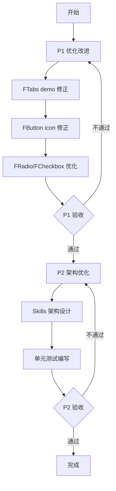

# FitUI 组件库修复计划

> **创建时间**: 2026-04-16  
> **优先级**: P1 > P2  
> **预计完成时间**: 1-2 个工作日

---

## 📋 目录

1. [P1 优化改进](#p1-优化改进)
2. [P2 架构优化](#p2-架构优化)
3. [实施流程](#实施流程)
4. [验收标准](#验收标准)

---

## P1 优化改进

### 1. FTabs demo 重复内容修正

#### 问题描述
当前 `packages/fit-test/src/examples/FTabs/index.vue` 存在重复的 demo 场景：
- **场景二**（卡片式标签页）和 **场景五**（卡片式标签页）重复
- **场景四**（可关闭标签页）和 **场景六**（可关闭的卡片式标签页）部分重复
- **场景三**（位置）和 **场景七**（不同标签位置）重复

#### 影响范围
- Demo 页面冗余，用户体验下降
- 代码维护成本增加

#### 修复方案

**步骤**:
1. 合并重复场景，保留更完整的实现
2. 重新编号场景，确保逻辑连贯
3. 优化场景描述，使其更清晰

**具体调整**:
```
原场景一（基础标签页） → 保留
原场景二（卡片式标签页） → 保留
原场景三（位置） + 原场景七（不同标签位置） → 合并为"标签位置"场景
原场景四（可关闭标签页） → 保留
原场景五（卡片式标签页重复） → 删除
原场景六（可关闭的卡片式标签页） → 保留
```

**预期结果**:
- 场景数量从 7 个减少到 5 个
- 每个场景功能明确，无重复

#### 验收标准
- [ ] Demo 场景无重复内容
- [ ] 场景编号连续（1-5）
- [ ] 每个场景有明确的测试目的
- [ ] 代码行数减少 30% 以上

---

### 2. FButton icon 类型使用修正

#### 问题描述
当前 FButton 组件的 icon 属性使用存在以下问题：
1. **类型定义**: `icon?: allIconType` - 允许所有图标类型，但实际使用可能有限制
2. **默认值**: `curBtnIcon = computed<allIconType>(() => props.icon ?? 'github')` - 默认使用 'github' 不合理
3. **Demo 使用**: Demo 中使用了 `icon="search"`, `icon="check"` 等，但未明确这些图标是否有效

#### 影响范围
- 组件 API 设计不清晰
- 可能导致图标渲染错误
- 用户体验不一致

#### 修复方案

**步骤**:
1. **检查图标系统**: 确认 `allIconType` 类型定义和可用图标列表
2. **修正默认值**: 将默认图标改为更合理的值（如 `undefined` 或 'default'）
3. **更新类型**: 考虑限制 icon 的类型范围或提供明确的文档
4. **修复 Demo**: 确保 Demo 使用的图标名称有效

**代码调整**:
```typescript
// 当前代码
const curBtnIcon = computed<allIconType>(() => props.icon ?? 'github')

// 修改为
const curBtnIcon = computed<allIconType | undefined>(() => props.icon)

// 或者提供合理的默认图标
const curBtnIcon = computed<allIconType>(() => props.icon ?? 'arrow-right')
```

#### 验收标准
- [ ] icon 属性类型定义清晰
- [ ] 默认图标合理或为 undefined
- [ ] Demo 中所有图标名称有效
- [ ] 添加 JSDoc 说明 icon 属性的使用场景

---

### 3. FRadio/FCheckbox label/value 用途明确

#### 问题描述
当前 FRadio 和 FCheckbox 组件的 label 和 value 属性用途不够明确：

**FRadio**:
- `label?: string` - 用于显示文本（通过插槽 fallback）
- `value?: string | number | boolean` - 用于绑定的实际值
- Demo 中使用：`<FRadio label="Option A" value="a">Option A</FRadio>`

**FCheckbox**:
- `label?: string` - 用于显示文本
- `value?: string | number | boolean` - 用于绑定的实际值
- Demo 中使用：`<FCheckbox label="Option A" value="a">Option A</FCheckbox>`

**问题**:
1. label 和插槽默认内容重复（都用 slot fallback）
2. 容易与原生 HTML 的 label 属性混淆
3. 缺少明确的 JSDoc 说明

#### 影响范围
- API 理解成本高
- 使用方式不统一
- 可能导致错误用法

#### 修复方案

**步骤**:
1. **更新 JSDoc**: 为 label 和 value 添加详细的注释
2. **明确用途**: 
   - `label`: 显示文本（当不提供插槽内容时使用）
   - `value`: 绑定的实际值（用于 v-model）
3. **优化 Demo**: 展示正确的使用方式
4. **考虑重命名**: 评估是否将 label 改为 text 或 content 更清晰

**代码调整**:
```typescript
export interface RadioProps {
  /** 
   * 单选框显示文本
   * @description 当不提供默认插槽内容时，使用此文本作为标签
   * @default undefined
   */
  label?: string
  
  /** 
   * 单选框绑定值
   * @description 选中时 v-model 更新的值
   * @example value="option1"
   */
  value?: string | number | boolean
  
  // ... 其他属性
}
```

**Demo 优化**:
```vue
<!-- 方式 1：使用 label 属性 -->
<FRadio label="选项 A" value="a" />

<!-- 方式 2：使用插槽（优先级更高） -->
<FRadio value="a">自定义内容</FRadio>

<!-- 方式 3：label + 插槽组合 -->
<FRadio label="选项 A" value="a">
  <span class="custom">自定义样式内容</span>
</FRadio>
```

#### 验收标准
- [ ] label 和 value 属性有清晰的 JSDoc 注释
- [ ] Demo 展示正确的使用方式
- [ ] 添加使用指南文档或注释
- [ ] 考虑是否需要在组件内部添加警告（当 label 和插槽内容同时存在时）

---

## P2 架构优化

### 4. Skills 架构设计与实现

#### 背景
当前项目已有完整的 Agent Skills 系统（位于 `.agents/skills/`），包含：
- `frontend-design`: 前端设计技能
- `ui-ux-pro-max`: UI/UX 设计系统
- `vite`, `vitest`: 构建和测试工具
- `vue-best-practices`: Vue 3 最佳实践
- `ckm-*`: 设计系统相关技能

#### 目标
1. **集成优化**: 确保 Skills 与项目规则系统协同工作
2. **技能扩展**: 为 FitUI 组件开发定制专用技能
3. **自动化流程**: 利用 Skills 提升开发效率

#### 实施步骤

**阶段一：现状分析**（已完成）
- ✅ Skills 目录结构已了解
- ✅ 与项目规则系统关联已明确

**阶段二：技能定制**
1. **创建 FitUI 专用技能**
   - 技能名称：`fitui-component-dev`
   - 功能：组件开发辅助
   - 位置：`.agents/skills/fitui-component-dev/`

2. **技能内容设计**
   ```markdown
   ---
   name: fitui-component-dev
   description: FitUI 组件开发专用技能
   ---
   
   # FitUI 组件开发技能
   
   ## 触发条件
   - 创建新组件
   - 重构现有组件
   - 编写组件测试
   
   ## 工作流程
   1. 读取项目规则（03-file-structure.md, 02-code-style.md）
   2. 生成符合规范的组件代码
   3. 自动创建标准目录结构
   4. 生成测试用例模板
   
   ## 输出标准
   - 符合 withInstall 包装规范
   - 使用 defineOptions 和 script setup
   - 样式使用 @use 语法
   - 包含完整的 JSDoc 注释
   ```

**阶段三：技能集成**
1. **配置自动激活**
   - 在 AGENTS.md 或技能配置中添加自动激活规则
   - 确保与现有技能（vue-best-practices, vitest）协同

2. **测试技能效果**
   - 使用技能创建测试组件
   - 验证输出代码符合规范
   - 收集反馈并优化

**阶段四：文档更新**
1. 更新 AGENTS.md
2. 添加技能使用示例
3. 提供快速开始指南

#### 交付物
- [ ] FitUI 专用技能文件（SKILL.md）
- [ ] 技能配置和集成
- [ ] 使用文档和示例
- [ ] 技能效果验证报告

---

### 5. 单元测试编写

#### 背景
根据 `06-testing.md` 规范，每个组件必须包含单元测试。当前项目部分组件已有测试，但需要：
1. 补充缺失的测试用例
2. 提升测试覆盖率
3. 确保测试质量

#### 目标
1. **覆盖率目标**: 核心组件测试覆盖率 > 80%
2. **测试完整性**: 每个组件至少包含 5 个基础测试
3. **测试质量**: 遵循测试最佳实践

#### 实施步骤

**阶段一：测试现状分析**
1. 检查所有组件的测试文件
2. 识别测试覆盖率不足的组件
3. 列出需要补充的测试用例

**阶段二：测试补充**

**优先级排序**:
- **P0**（必须）：无测试文件的组件
- **P1**（高）：测试用例少于 5 个的组件
- **P2**（中）：测试覆盖率低于 80% 的组件

**测试用例模板**:
```typescript
import { describe, expect, test } from 'vitest'
import { mount } from '@vue/test-utils'
import FComponentName from '..'

describe('FComponentName', () => {
  // 1. 基础渲染测试
  test('mounts correctly', () => {
    const wrapper = mount(FComponentName)
    expect(wrapper.exists()).toBe(true)
  })

  // 2. Props 测试
  test('renders props correctly', () => {
    const wrapper = mount(FComponentName, {
      props: { /* key props */ }
    })
    expect(wrapper.classes()).toContain('expected-class')
  })

  // 3. 事件测试
  test('emits events correctly', async () => {
    const wrapper = mount(FComponentName)
    await wrapper.trigger('click')
    expect(wrapper.emitted('click')).toBeTruthy()
  })

  // 4. 状态测试
  test('disabled state', async () => {
    const wrapper = mount(FComponentName, {
      props: { disabled: true }
    })
    expect(wrapper.classes()).toContain('is-disabled')
  })

  // 5. 插槽测试
  test('renders default slot', () => {
    const wrapper = mount(FComponentName, {
      slots: { default: '插槽内容' }
    })
    expect(wrapper.text()).toContain('插槽内容')
  })
})
```

**阶段三：测试运行验证**
1. 运行所有测试：`pnpm test:run`
2. 检查覆盖率：`pnpm test -- --coverage`
3. 修复失败的测试

**阶段四：持续集成**
1. 配置 CI 自动运行测试
2. 设置覆盖率门槛
3. 添加测试报告生成

#### 交付物
- [ ] 所有组件包含完整的测试文件
- [ ] 测试覆盖率报告（> 80%）
- [ ] 测试运行脚本和配置
- [ ] 测试最佳实践文档

---

## 实施流程

### 总体流程



### 详细步骤

#### 第一阶段：P1 优化改进（预计 0.5 天）

**步骤 1.1**: FTabs demo 修正
- [ ] 读取当前 demo 文件
- [ ] 识别并标记重复内容
- [ ] 合并重复场景
- [ ] 重新编号和整理
- [ ] 运行 demo 验证

**步骤 1.2**: FButton icon 修正
- [ ] 检查 allIconType 类型定义
- [ ] 确认可用图标列表
- [ ] 修正默认图标值
- [ ] 更新 JSDoc 注释
- [ ] 修复 Demo 中的图标使用

**步骤 1.3**: FRadio/FCheckbox 优化
- [ ] 更新属性 JSDoc 注释
- [ ] 优化 Demo 使用示例
- [ ] 考虑添加使用警告
- [ ] 验证修改效果

#### 第二阶段：P2 架构优化（预计 1-1.5 天）

**步骤 2.1**: Skills 架构设计
- [ ] 创建 FitUI 专用技能目录
- [ ] 编写 SKILL.md 文件
- [ ] 配置技能激活规则
- [ ] 测试技能效果
- [ ] 更新 AGENTS.md 文档

**步骤 2.2**: 单元测试编写
- [ ] 分析测试覆盖情况
- [ ] 列出缺失测试清单
- [ ] 补充测试用例
- [ ] 运行测试验证
- [ ] 生成覆盖率报告

---

## 验收标准

### P1 验收标准

| 任务 | 验收标准 | 验证方法 |
|------|----------|----------|
| FTabs demo 修正 | 场景无重复，编号连续 | 人工审查 + 代码行数对比 |
| FButton icon 修正 | 类型清晰，默认值合理 | 类型检查 + Demo 运行 |
| FRadio/FCheckbox 优化 | JSDoc 完整，示例清晰 | 文档审查 + Demo 运行 |

### P2 验收标准

| 任务 | 验收标准 | 验证方法 |
|------|----------|----------|
| Skills 架构 | 技能可用，输出符合规范 | 实际使用测试 |
| 单元测试 | 覆盖率 > 80%，所有测试通过 | 运行测试 + 覆盖率报告 |

### 整体验收流程

1. **代码审查**: 检查所有修改的代码
2. **测试运行**: `pnpm test:run` 所有测试通过
3. **Demo 验证**: 运行 demo 页面，手动验证
4. **文档检查**: 确保 JSDoc 和文档完整
5. **覆盖率检查**: 运行覆盖率测试

---

## 风险与应对

### 风险 1: Skills 集成复杂度高
- **应对**: 先小范围测试，逐步扩展
- **预案**: 如集成困难，先使用现有技能

### 风险 2: 测试覆盖率不达标
- **应对**: 优先保证核心功能测试
- **预案**: 分阶段提升覆盖率，先达到 60%，再逐步提升

### 风险 3: Demo 修改引入新 bug
- **应对**: 修改后充分测试
- **预案**: 保留原 demo 备份，必要时回滚

---

## 总结

本修复计划包含：
- **P1 优化改进**: 3 项，聚焦于修复现有问题
- **P2 架构优化**: 2 项，着眼于长期发展

**预期收益**:
1. Demo 质量提升，用户体验改善
2. 组件 API 更清晰，降低使用门槛
3. 开发效率提升（Skills 赋能）
4. 代码质量保障（测试覆盖）

**下一步行动**:
1. 确认计划无误
2. 开始实施 P1 任务
3. 完成后进入 P2 阶段

---

**版本**: 1.0.0  
**创建时间**: 2026-04-16  
**维护者**: FitUI Team
