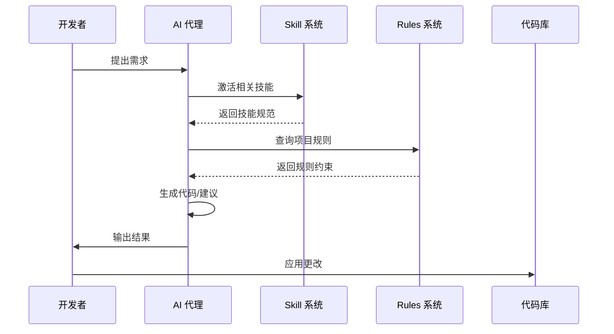

# Agent 技能系统

> **适用场景**：使用 AI 代理辅助开发 FitUI 组件库  
> **相关文件**：`.agents/skills/` 目录、`.trae/rules/` 规则文件  
> **预计阅读时间**：8 分钟

---

## 一、概述

### 1.1 定位

Agent 技能系统是 FitUI 项目的**智能开发辅助框架**，通过定义标准化的技能（Skills）规范，指导 AI 代理（如 Claude Code、Copilot、Gemini 等）在组件开发、UI 设计、测试编写等场景中提供高质量、一致性的辅助。

### 1.2 核心价值

- 🎯 **标准化输出**：确保 AI 代理遵循项目代码风格和设计规范
- 🚀 **提升效率**：自动化处理重复性任务（如样式生成、测试编写）
- 💡 **知识沉淀**：将最佳实践封装为可复用的技能模块
- 🔗 **生态集成**：支持多种 AI 开发工具（Claude Code、Copilot、Gemini CLI）

### 1.3 架构作用

```
┌─────────────────────────────────────────────────────┐
│              开发者 (Developer)                      │
└────────────────────┬────────────────────────────────┘
                     │ 输入需求
                     ▼
┌─────────────────────────────────────────────────────┐
│           AI 代理 (Claude/Copilot/Gemini)            │
│  ┌──────────────────────────────────────────────┐   │
│  │          Skill 技能系统                       │   │
│  │  ┌────────────┐  ┌────────────┐  ┌────────┐ │   │
│  │  │frontend-   │  │ui-ux-pro-  │  │ vite/  │ │   │
│  │  │design      │  │max         │  │vitest  │ │   │
│  │  └────────────┘  └────────────┘  └────────┘ │   │
│  └──────────────────────────────────────────────┘   │
└────────────────────┬────────────────────────────────┘
                     │ 输出代码/建议
                     ▼
┌─────────────────────────────────────────────────────┐
│            FitUI 组件库 / 文档站点                    │
│  packages/fit-ui/  │  packages/fit-docs/             │
└─────────────────────────────────────────────────────┘
```

---

## 二、核心功能

### 2.1 UI 设计与前端开发

**技能**: `frontend-design`, `ui-ux-pro-max`, `ckm-ui-styling`

**功能特性**:
- 生成生产级前端界面代码，避免通用 AI 美学
- 提供 50+ 种设计风格（Glassmorphism、Brutalism、Minimalism 等）
- 支持 shadcn/ui 组件库集成和主题定制
- 自动生成 Canvas 字体和视觉设计

**应用场景**:
```bash
# 示例：创建新组件页面
用户："为 FButton 组件创建一个现代化的示例页面"
→ AI 代理加载 frontend-design 技能
→ 生成具有独特美学设计的 Vue 3 组件
→ 应用项目指定的颜色系统和排版规范
```

### 2.2 构建工具配置

**技能**: `vite`, `vitest`

**功能特性**:
- Vite 配置优化和插件开发指导
- Vitest 单元测试编写和测试策略
- 构建性能优化（代码分割、Tree Shaking）

**应用场景**:
```bash
# 示例：优化构建配置
用户："优化 fit-ui 的构建配置以减小包体积"
→ AI 代理加载 vite 技能
→ 分析当前 vite.config.ts
→ 提供 rollup 配置优化建议和代码分割策略
```

### 2.3 Vue 3 最佳实践

**技能**: `vue-best-practices`

**功能特性**:
- Composition API + `<script setup>` 模式指导
- 响应式系统原理和性能优化
- 组件设计模式和可复用逻辑（Composables）

**应用场景**:
```typescript
// 示例：重构组件
用户："将 FModal 组件重构为 Composition API"
→ AI 代理加载 vue-best-practices 技能
→ 使用 defineProps/defineEmits 重构
→ 提供类型安全的 TypeScript 实现
```

### 2.4 品牌与设计系统

**技能**: `ckm-brand`, `ckm-design-system`, `ckm-design`

**功能特性**:
- 品牌视觉一致性检查
- 设计 Token 生成和管理
- Logo、图标、Banner 设计生成

---

## 三、设计架构

### 3.1 技能结构

每个技能（Skill）是一个独立的 Markdown 文件，包含：

```markdown
---
name: skill-name
description: 技能描述
license: 许可信息
---

# 技能说明

## 触发条件
何时激活此技能

## 工作流程
1. 步骤一
2. 步骤二

## 示例
使用示例和最佳实践
```

### 3.2 目录组织

```
.agents/
└── skills/
    ├── frontend-design/      # 前端设计技能
    │   ├── SKILL.md          # 技能定义
    │   └── LICENSE.txt       # 许可
    ├── ui-ux-pro-max/        # UI/UX 设计系统
    ├── vite/                 # Vite 构建工具
    ├── vitest/               # Vitest 测试框架
    ├── vue-best-practices/   # Vue 3 最佳实践
    └── ckm-*                 # 设计系统相关技能
```

### 3.3 激活机制

不同 AI 平台的技能激活方式：

| 平台 | 激活方式 |
|------|----------|
| **Claude Code** | 使用 `Skill` 工具 |
| **Copilot CLI** | 使用 `skill` 工具 |
| **Gemini CLI** | 使用 `activate_skill` 工具 |
| **其他环境** | 查看平台文档 |

---

## 四、使用方法

### 4.1 前置条件

- 安装支持的 AI 开发工具（Claude Code、Copilot CLI、Gemini CLI 等）
- 配置项目环境变量（如需要）
- 确保 `.agents/skills/` 目录存在且包含技能文件

### 4.2 基本流程

```bash
# 1. 启动 AI 代理会话
claude  # 或 copilot、gemini

# 2. 提出开发需求
"为 FButton 组件添加 loading 状态的测试用例"

# 3. AI 代理自动激活相关技能
# → 加载 vue-best-practices 技能
# → 加载 vitest 技能

# 4. 审查 AI 生成的代码
# 确保符合项目规范

# 5. 应用更改
```

### 4.3 代码示例

**示例 1：创建新组件**

```vue
<!-- 用户请求 -->
"创建一个 FCard 卡片组件，支持头像、标题、内容和操作区域"

<!-- AI 代理输出（简化版） -->
<template>
  <div :class="['f-card', `f-card--${size}`]">
    <div v-if="$slots.header" class="f-card__header">
      <slot name="header"></slot>
    </div>
    <div class="f-card__body">
      <slot></slot>
    </div>
    <div v-if="$slots.footer" class="f-card__footer">
      <slot name="footer"></slot>
    </div>
  </div>
</template>

<script setup lang="ts">
import type { SizeType } from '@/types'

interface CardProps {
  size?: SizeType
}

const props = withDefaults(defineProps<CardProps>(), {
  size: 'medium'
})
</script>
```

**示例 2：编写测试**

```typescript
// 用户请求
"为 FCard 组件编写单元测试"

// AI 代理输出（简化版）
import { mount } from '@vue/test-utils'
import { describe, it, expect } from 'vitest'
import FCard from '../index.vue'

describe('FCard', () => {
  it('renders default slot content', () => {
    const wrapper = mount(FCard, {
      slots: { default: '卡片内容' }
    })
    expect(wrapper.text()).toContain('卡片内容')
  })

  it('applies size class', () => {
    const wrapper = mount(FCard, {
      props: { size: 'large' }
    })
    expect(wrapper.classes()).toContain('f-card--large')
  })
})
```

---

## 五、配置参数

### 5.1 技能元数据

每个技能文件头部包含配置参数：

```yaml
name: frontend-design           # 技能名称（唯一标识）
description: 技能描述           # 用于技能发现和匹配
license: LICENSE.txt            # 许可信息
```

### 5.2 平台配置

不同平台可能需要额外配置：

```json
// Claude Code 配置（.claude/settings.json）
{
  "skills": {
    "enabled": true,
    "autoActivate": ["frontend-design", "vue-best-practices"]
  }
}

// Gemini CLI 配置（GEMINI.md）
{
  "skills_directory": ".agents/skills/",
  "auto_discover": true
}
```

### 5.3 环境变量

```bash
# .env.local
AI_SKILLS_DIR=.agents/skills/
ENABLE_SKILL_CHECK=true
```

---

## 六、模块交互

### 6.1 与项目规则系统交互

Agent 技能系统与 `.trae/rules/` 规则文件协同工作：

```
┌─────────────────┐         ┌──────────────────┐
│  Agent Skills   │────────▶│  Project Rules   │
│  (.agents/)     │  引用   │  (.trae/rules/)  │
└─────────────────┘         └──────────────────┘
       │                            │
       │ 遵循                        │ 定义
       ▼                            ▼
┌─────────────────────────────────────────────┐
│          生成的代码 / 建议                    │
│  - 符合代码风格（02-code-style.md）          │
│  - 遵循文件结构（03-file-structure.md）      │
│  - 满足测试标准（06-testing.md）             │
└─────────────────────────────────────────────┘
```

### 6.2 数据流转



### 6.3 接口定义

**Skill 工具接口**（以 Claude Code 为例）：

```typescript
interface SkillTool {
  name: string
  description: string
  invoke(params: SkillParams): Promise<SkillResult>
}

interface SkillParams {
  skillName: string
  context?: Record<string, any>
}

interface SkillResult {
  success: boolean
  content?: string
  error?: string
}
```

---

## 七、开发规范

### 7.1 代码风格

所有 AI 生成的代码必须遵循：

- ✅ [02-code-style.md](.trae/rules/02-code-style.md) - 代码风格规范
- ✅ [03-file-structure.md](.trae/rules/03-file-structure.md) - 文件结构规范
- ✅ [06-testing.md](.trae/rules/06-testing.md) - 测试标准

**示例**：

```typescript
// ✅ 正确：符合规范
interface ButtonProps {
  /** 
   * 按钮类型 
   * @default 'default'
   */
  type?: ButtonType
}

// ❌ 错误：缺少 JSDoc
interface ButtonProps {
  type?: ButtonType
}
```

### 7.2 命名规范

**技能文件命名**：
- 使用小写字母和连字符：`frontend-design.md`
- 避免使用空格和下划线

**技能名称命名**：
- 使用小写字母和连字符：`ui-ux-pro-max`
- 保持描述性和唯一性

### 7.3 扩展指南

**新增技能步骤**：

1. 在 `.agents/skills/` 下创建技能目录
2. 编写 `SKILL.md` 文件，包含：
   - 元数据（name, description, license）
   - 触发条件
   - 工作流程
   - 使用示例
3. 测试技能激活和功能
4. 更新本文档

**技能开发模板**：

```markdown
---
name: my-skill
description: 技能简述
---

# 技能名称

## 何时使用
说明触发条件

## 工作流程
1. 第一步
2. 第二步

## 示例
提供代码示例
```

### 7.4 注意事项

⚠️ **重要**：
- 技能文件应独立于具体 AI 平台
- 避免硬编码平台特定的工具名称
- 保持技能专注单一职责
- 定期更新技能以反映项目变化

---

## 八、故障排除

### 8.1 常见问题

**问题 1：技能未激活**

```bash
# 检查技能文件是否存在
ls -la .agents/skills/frontend-design/SKILL.md

# 检查 AI 代理配置
# 确认已启用 Skill 工具
```

**问题 2：技能冲突**

当多个技能可能适用时，AI 代理会：
1. 优先激活流程技能（如 debugging、brainstorming）
2. 然后激活实现技能（如 frontend-design）

### 8.2 调试技巧

```bash
# 查看技能加载日志
# Claude Code: 检查控制台输出
# Copilot: 查看扩展日志

# 强制重新加载技能
# 重启 AI 代理会话
```

---

## 九、相关链接

- [技能使用指南](.agents/skills/using-superpowers/SKILL.md)
- [前端设计技能](.agents/skills/frontend-design/SKILL.md)
- [项目规则索引](.trae/rules/00-index.md)
- [开发工具规范](.trae/rules/10-dev-tools.md)

---

**版本**: 1.0.0  
**最后更新**: 2026-04-16  
**维护者**: FitUI Team
